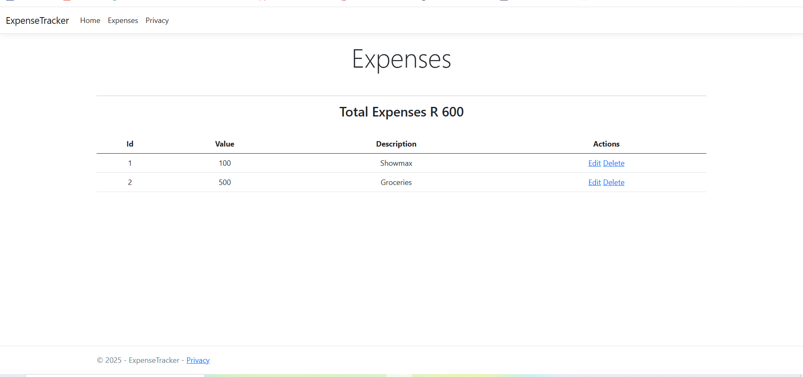

# ExpenseTracker
# 💸 Expense Tracker - ASP.NET Core MVC

 <!-- Replace 'preview.png' with the actual screenshot file path -->

## 📋 Project Overview

This is a simple yet powerful Expense Tracker web application built using **ASP.NET Core MVC**. The app allows users to record and monitor their expenses while learning about:

- The **Model-View-Controller (MVC)** pattern in ASP.NET Core.
- Using **Entity Framework Core** to manage data.
- Working with an **in-memory database** for fast and easy data persistence during development.

---

## 🛠 Features

- Add, view, and delete expenses
- Categorize expenses
- Automatically track total spendings
- Use of ASP.NET Core MVC design pattern
- Entity Framework Core integration with an in-memory database

---

## 🧰 Technologies Used

- ASP.NET Core MVC
- Entity Framework Core
- In-Memory Database Provider
- Razor Pages
- C#

---

## 🖼 Preview

> 📷 Replace the image below with a real screenshot of your app once available.


---

## 🚀 Getting Started

### Prerequisites

- [.NET 6 SDK](https://dotnet.microsoft.com/en-us/download) or later
- Visual Studio 2022 or Visual Studio Code

### Installation Steps

1. **Clone the repository:**
   ```bash
   git clone https://github.com/yourusername/expense-tracker.git
   cd expense-tracker
